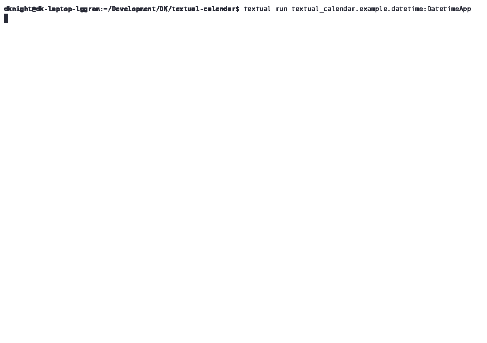

# textual-calendar

A calendar date/time picker widget for Textual UI.



## Features

- **Calendar Widget** - Interactive monthly calendar date selection
- **Time Widget** - Time picker with hour, minute, and second selection
- **Timezone Support** - Optional timezone selection with auto-complete
- **DatetimePicker** - Combined date and time picker
- **Keyboard Navigation** - Full keyboard support with arrow keys, Page Up/Down
- **Mouse Support** - Click to select dates

## Installation
```bash
pip install textual-calendar
```

## Quick Start

### Calendar Widget
```python
from textual.app import App
from textual_calendar import Calendar

class MyApp(App):
    def compose(self):
        yield Calendar()

if __name__ == "__main__":
    MyApp().run()
```

### Time Widget
```python
from textual_calendar import Time

class MyApp(App):
    def compose(self):
        yield Time(show_tz=True)  # With timezone support
```

### DatetimePicker Widget
```python
from textual_calendar import DatetimePicker
from datetime import datetime

class MyApp(App):
    def compose(self):
        yield DatetimePicker(
            initial_datetime=datetime.now(),
            show_tz=True
        )
```

## Keyboard Shortcuts

### Calendar
- `←/→` - Previous/Next day
- `↑/↓` - Previous/Next month
- `Page Up/Down` - Previous/Next year
- `Insert` - Manual date input dialog

### Time
- `←/→` - Move between hour/minute/second
- `↑/↓` - Increment/Decrement selected field
- `0-9` - Direct number input

## License

BSD-3-Clause License - see LICENSE file for details.

## Contributing

Contributions are welcome! Please feel free to submit a Pull Request.
